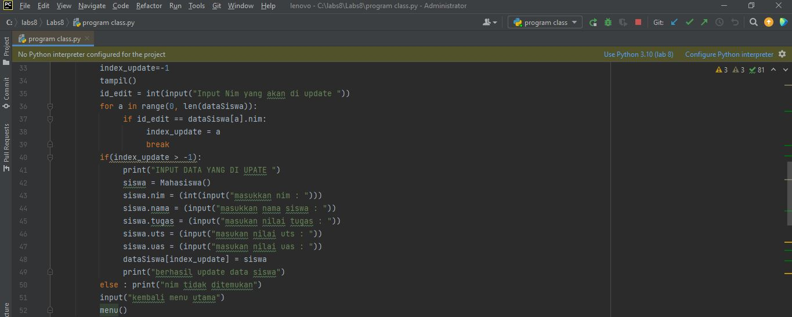

# Labs8
## M. AKMAL AL ABDILAH(312110034)
### TUGAS PROGRAM LAB 8

A. Tugas Praktikum'
'
Buat program sederhana dengan mengaplikasikan penggunaan class. Buatlah 
class untuk menampilkan daftar nilai mahasiswa, dengan ketentuan:
• Method tambah() untuk menambah data
• Method tampilkan() untuk menampilkan data
• Method hapus(nama) untuk menghapus data berdasarkan nama
• Method ubah(nama) untuk mengubah data berdasarkan nama
• Buat diagram class, flowchart dan penjelasan programnya pada 
README.md.
• Commit dan push repository ke github'
'

1. Program sederhana saja untuk menampung data mahasiswa dengan fungsi-fungsi standar seperti tampil, tambah, edit,  dan hapus data. Aplikasi yang akan kita buat belum menggunakan database sebagai media penyimpan data. Jadi datanya hanya disimpan sementara di memory jika aplikasi di tutup maka datanya pun akan hilang.
Langkah-langkahnya :
Buat kelas untuk menampung data masiswa serta atribut-atributnya. Disini saya hanya menggunakan 5 atribut yaitu nim, nama, tugas, uts, dan uas.'
'

2. Buat variable untuk menampung list data dari object mahasiswa dan sebuah variable untuk menampung nilai saat user memilih menu'
'

3. Buat sebuah method untuk menampilkan daftar menu dan fungsi untuk user memilih menu sesuai keinginan.'
'

B.  Untuk penjelasan kode diatas, program akan menampilkan daftar menu dari 1-6. User akan menginput pilihan sesuai menu yang di pilih, dan inputan user tersebut di tampung di variabel pilih dengan tipe datanya int.
Setelah buat itu buat fungsi untuk mengecek nilai dari inputan user, contohnya jika pilih==1 maka panggil fungsi pilih1() setelah proses selesai tampilkan menu utama. Jika pilih==2 lakukan fungsi menu 2 dan seterusnya sampai fungsi ke 5. fungsi menu yang keenam yaitu untuk keluar dari program.'
'

1. Fungsi view datanya'
'

2. Fungsi tambah datanya'
'

C. penjelasan kode diatas, buat perulangan untuk mengecek jika user ingin menginput lebih dari 1x. nilai untuk menampung pilihan user ada pada variabel ulang dengan nilai awal y. while(y) maka buat object mahasiswa dan isi nilainya sesuai dengan inputan user.'
'

1. Fungsi update datanya'
'

D. pertama kita isi nilai indexnya dengan -1. setelah itu panggil fungsi tampil untuk menampilkan seluruh data. kemudian user akan menginput nim yang akan di hapus, lakukan pengecekan jika nim==yang ada pada list ubah nilai id_edit sesuai index pada list. selanjutnya buat fungsi untuk user menginput nim dan nama yang akan diupdate kemudian set nilai list berdasarkan id_edit sesuai dengan nilai object mahasiswa yang sudah di input'
'

1. Fungsi delete'
'

E. pada kode di atas sama dengan fungsi pada update data. user akan di minta menginput nim yang akan di hapus, kemudian cek nilai nim yang akan di hapus pada list. jika nilainya ada pada list set nilai pada id_hapus sesuai index di mana nim di temukan. selanjutnya gunakan fungsi remove untuk menghapus data siswa dari list.

1. Pada baris paling akhir panggil fungsi untuk menampilkan menu yang kita sudah buat tadi'
'

F. Ini adalah Contoh Coding lengkapnnya:'
'

import os
import sys

class Mahasiswa:
 nim=''
 nama=''
 tugas=''
 uts=''
 uas=''

dataSiswa = []
pili = 0

def menu():
     os.system('cls')
     print("Menu Aplikasi Data Siswa LinkedList python")
     print("-------------------------------------------")
     print("1. Input Data Siswa")
     print("2. Tampilkan Data Siswa")
     print("3. Update Data Siswa")
     print("4. Hapus Data Siswa")
     print("5. Author")
     print("6. Keluar Aplikasi")
     pilih = int(input("Masukkan pilihan anda : "))
     if pilih == 1 :
          pilih1()
          menu()
     elif pilih == 2:
          tampil()
          input("kembali menu utama")
          menu()
     elif pilih == 3:
          index_update=-1
          tampil()
          id_edit = int(input("Input Nim yang akan di update "))
          for a in range(0, len(dataSiswa)):
               if id_edit == dataSiswa[a].nim:
                    index_update = a
                    break
          if(index_update > -1):
               print("INPUT DATA YANG DI UPATE ")
               siswa = Mahasiswa()
               siswa.nim = (int(input("masukkan nim : ")))
               siswa.nama = (input("masukkan nama siswa : "))
               siswa.tugas = (input("masukan nilai tugas : "))
               siswa.uts = (input("masukan nilai uts : "))
               siswa.uas = (input("masukan nilai uas : "))
               dataSiswa[index_update] = siswa
               print("berhasil update data siswa")
          else : print("nim tidak ditemukan")
          input("kembali menu utama")
          menu()
     elif pilih == 4:
                os.system('cls')
                tampil()
                id_hapus = int(input("Input Nim yang akan di hapus : "))
                for data in dataSiswa:
                    if data.nim == id_hapus:
                         dataSiswa.remove(data)
                    else :
                         print("data tidak di temukan")
                print("DATA MAHASISWA ")
                for data in dataSiswa:
                    print("Nim : "+str(data.nim));
                    print("Nama  : "+data.nama)
                input("kembali menu utama")
                menu()
     elif pilih == 5 :
          author()
          
          menu()
     elif pilih == 6 :
          sys.exit()

def tampil():
	os.system('cls');
	print("DATA MAHASISWA")
	for data in dataSiswa:
		print("Nim : "+str(data.nim)) 
		print("Nama : "+data.nama)
		print("Nilai Tugas : "+data.tugas)
		print("Nilai Uts : "+data.uts)
		print("Nilai Uas : "+data.uas)
		
		print("----------------------")
		
def author():
	os.system('cls')
	print("M. AKMAL AL ABDILAH | 312110034")
	print("UPB 2021")

def pilih1():
	ulang = 'Y'
	while ulang in('y', 'Y'):
		os.system('cls')
		siswaBaru = Mahasiswa() 
		print("INPUT DATA MAHASISWA ") 
		siswaBaru.nim = (int(input("masukkan nim : "))) 
		siswaBaru.nama = (input("masukkan nama siswa : "))
		siswaBaru.tugas = (input("masukan nilai tugas : "))
		siswaBaru.uts = (input("masukan nilai uts : "))
		siswaBaru.uas = (input("masukan nilai uas : "))
		dataSiswa.append(siswaBaru) 
		ulang = input("Apakah Anda Ingin Mengulang (Y/ T)? ")		

menu()'
'

G. Dan Ini adalah Hasil Outputnnya:'
'

G. Ini Adalah Flowchartnya:'
'

H. Ini Adalah Diagram Classnya:'
'

OK SEKIAN TUGAS LAB 8 INI SAYA BUAT KURANG LEBIHNYA SAYA MOHON MAAF'
'

    

